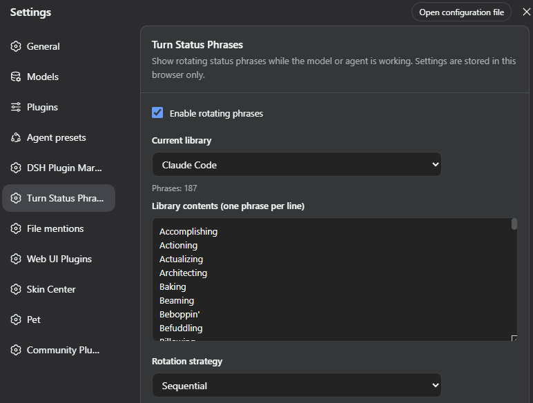
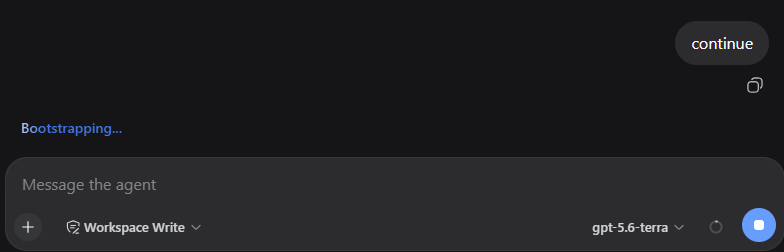

# DSH Turn Status Phrases

A DSH Web plugin / Cordis bundle for replacing the static `turnStatus` text with rotating custom status phrases while a model or agent is working.

Keywords: DSH plugin, DeepSeek Harness plugin, DSH Web extension, Cordis plugin, turn status phrases.

## Installation

Run the following command from the plugin directory:

```bash
dsh plugin --profile web add .
```

Restart DSH Web and enable **Turn status phrases** in the settings. The default library is **Chinese Mythology**.

## Preview

Use the settings page to choose a library, pause rotating phrases, and view the current library's contents:



While a model or agent is working, the status text rotates through the selected phrases:



## Features

- Rotates phrases while a model or agent is working. The display duration is based on the phrase's UTF-8 byte length: 100 ms per byte, clamped between 1.8 and 8 seconds. The same phrase is not shown twice in a row when alternatives are available.
- Includes eight built-in libraries: Chinese Mythology, Claude Code, Chinese Modal Words, Classical Chinese Interjections, Journey to the West, Romance of the Three Kingdoms, Niulai Meme, and China Slogans.
- Provides a settings page for switching libraries, pausing dynamic phrases, and viewing the current library in a copyable read-only text area.
- Stores configuration only in the current browser's local storage. No data is uploaded.
- Custom library editing is not available yet. Existing custom-library data can still be removed from the settings page.

## Development

Requirements:

- Node.js 18 or later
- A DSH Web environment that supports client module injection

Install dependencies and run the test suite:

```bash
npm install
npm test
```

`npm test` first runs the client build and then executes the Node.js test suite. To update the generated built-in library data in `lib/client.js` without running tests, use:

```bash
npm run build
```

## Adding a Built-in Library

Each built-in library has its own module in `lib/builtin-libraries/`. To add one:

1. Create `lib/builtin-libraries/<library-id>.js` with a default export containing `id`, `name`, and `phrases`:

   ```js
   export default {
     id: "example-library",
     name: "Example Library",
     phrases: ["First phrase", "Second phrase"]
   };
   ```

2. Import the module in `lib/builtin-libraries/index.js` and add it to `BUILTIN_LIBRARY_LIST`. The array controls the order shown in settings, and its first item is the default library.
3. Run `npm run build` to regenerate the embedded library data in `lib/client.js`. Do not edit the generated block manually.
4. Run `npm test` to verify the registry and phrase-selection logic.

After updating a built-in library, reinstall or update the plugin and refresh DSH Web.

## License

MIT
