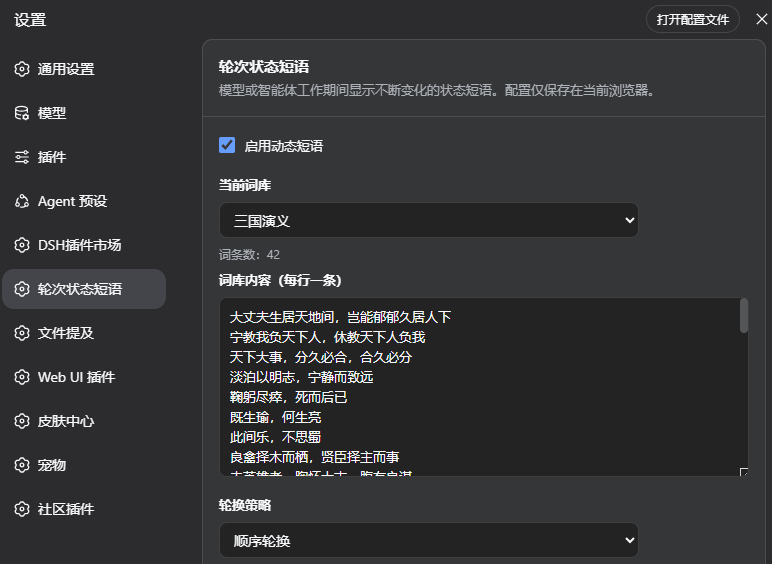
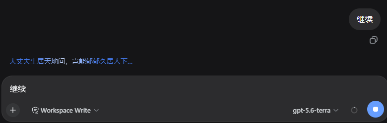

# DSH Turn Status Phrases

一个面向 [DeepSeek Harness](https://github.com/deepseek-ai) 的 DSH Web plugin / Cordis bundle。它让 DSH Web 的 `turnStatus` 状态文字变成持续变化的自定义轮次状态短语。

Keywords: DSH plugin, DeepSeek Harness plugin, DSH Web extension, Cordis plugin, turn status phrases.

## 安装

在插件目录执行：

```bash
dsh plugin --profile web add .
```

重启 DSH Web 后，在设置中打开“轮次状态短语”。默认词库为“中国神话”。

## 界面预览

设置页可选择词库、暂停动态短语，并查看当前词库内容：



模型或智能体工作时，状态文字会在短语之间轮换：



## 功能

- 模型或智能体工作期间按短语的 UTF-8 字节数轮换，按每字节 100 毫秒计算，最短 1.8 秒，最长 8 秒；不会连续显示同一句。
- 内置“中国神话”词库，包含嫦娥奔月、精卫填海、夸父逐日、后羿射日、女娲补天等。
- 内置“Claude Code”词库，收录 Claude Code CLI 的 187 条 spinner 状态词，如 Pondering、Noodling、Musing 等。
- 设置页支持切换词库、暂停动态短语和查看可复制的词库内容；自定义词库编辑功能正在开发中。
- 配置只保存在当前浏览器本地，不上传网络。

## 新增内置词库

每个内置词库在 `lib/builtin-libraries/` 中独占一个模块文件。新增词库时：

1. 创建 `lib/builtin-libraries/<library-id>.js`，默认导出 `id`、`name` 和 `phrases`：

   ```js
   export default {
     id: "example-library",
     name: "Example Library",
     phrases: ["First phrase", "Second phrase"]
   };
   ```

2. 在 `lib/builtin-libraries/index.js` 导入模块，并将其加入 `BUILTIN_LIBRARY_LIST`。词库在设置页中的显示顺序与该数组一致；默认词库由列表首项决定。
3. 执行 `npm run build`，从注册表更新 `lib/client.js` 中供 DSH Web 加载的内置词库数据。不要手动编辑该生成区块。
4. 执行 `npm test`；它会再次构建客户端数据，并验证词库注册表及短语逻辑。

内置词库更新后重新安装或更新插件，并刷新 DSH Web 页面即可生效。
